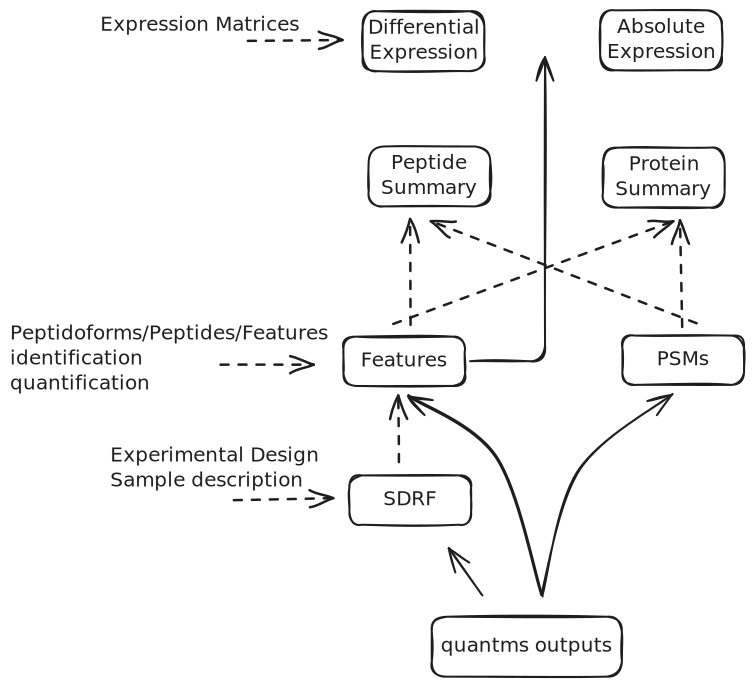

= The quantms.io format
:sectnums:
:toc: left
:doctype: book
//only works on some backends, not HTML
:showcomments:
//use style like Section 1 when referencing within the document.
:xrefstyle: short
:figure-caption: Figure
:pdf-page-size: A4

//GitHub specific settings
ifdef::env-github[]
:tip-caption: :bulb:
:note-caption: :information_source:
:important-caption: :heavy_exclamation_mark:
:caution-caption: :fire:
:warning-caption: :warning:
endif::[]

[[introduction]]
== Introduction

The majority of formats in HUPO-PSI are based on XML format including mzML, mzIdentML making difficult to use them for large-scale, AI model technologies. Also, the previous approach to move away from XML-based approaches, mzTab "falls short" to produce a tab-delimited format that can scale with the size of the data. Here, we aim to formalize and develop a more standardized format that enables better representation of the identification and quantification results but also enables new and novel use cases for proteomics data analysis. The main use cases for the format are:

- Fast and easy visualization of the identification and quantification results.
- Easy integration with other omics data.
- Easy integration with sample metadata.
- AI/ML model development based on identification and quantification results.
- Easy data retrieval for big datasets and large-scale collections of proteomics data.

NOTE: We are not trying to replace the mzTab format, but to provide a new format that enables AI-related use cases.

[[general-data-model]]
== General data model and structure

The `quantms.io` (.qms) could be seen as a **multiple view** representation of a proteomics data analysis results. Similar to other tools that produce multiple output files for their analysis, like https://www.maxquant.org/[MaxQuant], https://github.com/vdemichev/DiaNN[DIA-NN], https://fragpipe.nesvilab.org/[FragPipe] or https://biognosys.com/software/spectronaut/[spectronaut]. Each view of the format can be serialized in different formats depending on the use case. The **data model** defines two main things, the **view** and how the view is **serialized**. Both views and serialization can be extended, and new views can be added on each <<version>> of the specification.


   :width: 80%
   :align: center

- The **data model view** defines the structure, the fields and properties that will be included in a view for each peptide, psms, feature or protein.
- The **data serialization** defines the format in which the view will be serialized and what features of serialization will be supported, for example, compression, indexing, or slicing.

|===
| *view*       | *file class*      | *serialization format* | *definition*
| psm          | psm_file          | _parquet_              | <<psm>>
| feature      | feature_file      | _parquet_              | <<feature>>
| absolute     | absolute_file     | _tsv_                  | <<absolute>>
| differential | differential_file | _tsv_                  | <<differential>>
| sdrf         | sdrf_file         | _tsv_                  | <<sdrf>>
| project      | -                 | _json_                 | <<project>>
|===

NOTE: Some of these data models fit better for some analytical methods than others, for example, the **psm view** <<psm>> is more suitable for data-dependent acquisition (DDA) methods, and may not be present in data-independent acquisition (DIA) methods; while the **feature view** <<feature>> could be generated in both DDA and DIA methods. Different expression view <<differential>> are only present in those experiments while absolute-expression (based on IBAQ values) is only available on datasets where comparisons are not performed between conditions.

[[file-structure]]

The `.qms` folder will contain multiple metadata files that will be used to describe the project, the samples, the data acquisition and the data processing.

[[common-data-structures]]
== Common data structures and formats

We have some concepts that are common for some outputs and would be good to define and explain them here: 

[[peptidoform]]
=== Peptidoform

A peptidoform is a peptide sequence with modifications. For example, the peptide sequence `PEPTIDM` with a modification of `Oxidation` would be `PEPTIDM[Oxidation]`. The peptidoform show be written using the https://github.com/HUPO-PSI/ProForma[Proforma specification]. This concept is used in the following outputs:

  - <<psm>>
  - <<feature>>
  - <<peptide>>

[[modifications]]
=== Modifications

A modification is a chemical change in the peptide sequence. Modifications can be annotated in multiple ways in `quantms.io` format:

- As part of the Proforma notation inside the peptide or as a separate by `[Oxidation]` with  modification name or accession: For example, `Oxidation` or `UNIMOD:35`. It Is RECOMMENDED to report modifications using UNIMOD. If a modification is not defined in UNIMOD, a CHEMMOD definition must be used like `CHEMMOD:-18.0913`, where the number is the mass shift in Daltons.
- As a list of modification names for each peptidoform for easy integration and filtering of the given peptide evidence. For example, `Oxidation;Phosphorylation`.
- Full modification annotation with the given position, modification name, and quality score. In this case, modifications will be encoded as:
  ** Accession or name: The modification accession or name. For example, `CHEMMOD:-18.0913`, `UNIMOD:35` or `Oxidation`.
  ** Position: The position of the modification in the peptide sequence. Terminal modifications in proteins and peptides MUST be reported with the position set to 0 (N-terminal) or the amino acid length +1 (C-terminal) respectively. For example, `1` or `1,2,3`.
  ** Localization Probability: The probability of the modification being in the reported position.

Those three properties can be combined in one string as:

`{position}({Probabilistic Score:0.9})|{position2}|..-{modification accession or name}`

For example:

```
1(Probabilistic Score:0.8)|2(Probabilistic Score:0.9)|3-UNIMOD:35`
```

This concept is used in the following outputs:

- <<psm>>
- <<feature>>
- <<peptide>>

[[serialization]]
== Serialization formats

The `quantms.io` format has different serialization formats for each view. The serialization format defines how the view will be serialized and what features of serialization will be supported, for example, compression, indexing, or slicing. The following serialization formats are supported:

- **tsv**: Tab-separated values format.
- **parquet**: Apache Parquet format.
- **json**: JavaScript Object Notation format.

[[parquet-format]]
=== Parquet format

https://github.com/apache/parquet-format[Parquet] is a columnar storage format that supports nested data. For these large-scale analyses, Parquet has helped its users reduce storage requirements by at least one-third on large datasets, in addition, it greatly improved scan and deserialization time (web use-cases), hence the overall costs. The following table compares the savings as well as the speedup obtained by converting data into Parquet from CSV.

[[parquet-features]]
==== Parquet Features

- **Columnar Storage**: Parquet's columnar design improves compression and query performance by storing data by columns rather than rows, which reduces I/O for analytical queries that typically access only a few columns.
- **Efficient Compression**: The format achieves better compression ratios with algorithms like Snappy, Gzip, and LZO, and uses techniques like RLE, bitpacking, and dictionary encoding for further optimization.
- **Schema Evolution**: Parquet supports adding, deleting, or modifying columns without affecting existing data, making it adaptable to schema changes.
- **Complex Data Types**: Supports nested structures and data types like arrays, maps, and structs, allowing efficient storage of complex data.

|===
| *Dataset*                            | *Size on Amazon S3* | *Query Run Time* | *Data Scanned*
| Data stored as CSV files             | 1 TB                | 236 seconds      | 1.15 TB
| Data stored in Apache Parquet Format | 130 GB              | 6.78 seconds     | 2.51 GB
|===

==== Parquet slicing
//TODO: Add information about parquet slicing and how it should be included in the json project file.

[[extensions]]
== File extensions

File extensions are used to identify the file type. In `quantms.io` the extensions are constructed as follows: `*.{view}.{format}` where the view is one of the well-defined views in the specification and the format is one of the serialization formats. For example:

- An absolute expression file: PXD000000-943a8f02-0527-4528-b1a3-b96de99ebe75.absolute.tsv
- A differential expression file: PXD000000-943a8f02-0527-4528-b1a3-b96de99ebe75.differential.tsv
- A feature file: PXD000000-943a8f02-0527-4528-b1a3-b96de99ebe75.feature.parquet
- A psm file: PXD000000-943a8f02-0527-4528-b1a3-b96de99ebe75.psm.parquet

NOTE: In `quantms.io` we use the UUID to identify the project and the files `{PREFIX}-{UUID}.{view}.{format}`, it is optional, but for most of the code examples we will use it. *uuids*: A Universally Unique Identifier (UUID) URN Namespace, as defined in RFC 4122, provides a standardized method for generating globally unique identifiers across various systems and applications. The UUID URN Namespace ensures that each generated UUID is highly unlikely to collide with any other UUID, even when produced by different entities and systems.

[[version]]
== Versioning

The current `quantms.io` specification version is:

- **1.0.0**

All views and serialization formats will have a version number in the way: `quantmsio_version: {}`. This will help to identify the version of the specification used to generate the file.

[[project]]
== Project quantms.io

The project view is the file that stores the metadata of the entire `quantms.io` project. The project view is a JSON file that contains the following fields:

=== Project fields

|===
| **Field**                 | **Description**                              | **Type**
| `project_accession`       | Project accession identifier                 | string
| `project_title`           | Title of the project                         | string
| `project_sample_description` | Description of the project sample         | string
| `project_data_description` | Description of the project data             | string
| `project_pubmed_id`       | PubMed ID associated with the project        | integer
| `organisms`               | List of organisms involved in the project    | list[string], null
| `organism_parts`          | Parts of organisms studied                   | list[string], null
| `diseases`                | Diseases associated with the study           | list[string], null
| `cell_lines`              | Cell lines used in the study                 | list[string], null
| `instruments`             | Instruments used for data acquisition        | list[string]
| `enzymes`                 | Enzymes used in the study                    | list[string]
| `experiment_type`         | Types of experiments conducted               | list[string]
| `acquisition_properties`  | Properties of the data acquisition methods   | list[key/value]
| `quantms_files`           | Files related to quantMS analysis            | list[key/value]
| `quantmsio_version`       | Version of the `quantms.io`                    | String
| `quantms_version`         | Version of the quantms workflow              | String
| `comments`                | Additional comments or notes                 | List of Strings
|===

Key/Value pair object: The key/value pairs are used to store the acquisition properties, and the  quantms files.

Example of ``acquisition_properties``:

[source,json]
----
   "acquisition_properties": [
        {"precursor tolerance": "0.05 Da"},
        {"dissociation method": "HCD"}
   ]
----

=== Project files

Recommendations for the file name in the quantms project.

Example of ``quantms_files``:

[source,json]
----
   "quantms_files": [
        {"psm_file":   ["PXD004683-550e8400-e29b-41d4.1.psm.parquet",
                        "PXD004683-550e8400-e29b-41d4.2.psm.parquet"
        ]},
        {"feature_file": ["PXD004683-958e8400-e29b-41f4.feature.parquet"]},
        {"differential_file": ["PXD004683-a716.differential.tsv"]},
        {"absolute_file":     ["PXD004683-e29b-41f4-a716.absolute.tsv"]},
        {"sdrf_file":         ["PXD004683-e29b-41f4-a716.sdrf.tsv"]}
   ]
----

Example:

[source,json]
----
   {
    "project_accession": "PXD014414",
    "project_title": "",
    "project_sample_description": "",
    "project_data_description": "",
    "project_pubmed_id": 32265444,
    "organisms": [
        "Homo sapiens"
    ],
    "organism_parts": [
        "mammary gland",
        "adjacent normal tissue"
    ],
    "diseases": [
        "metaplastic breast carcinomas",
        "Triple-negative breast cancer",
        "Normal",
        "not applicable"
    ],
    "cell_lines": [
        "not applicable"
    ],
    "instruments": [
        "Orbitrap Fusion"
    ],
    "enzymes": [
        "Trypsin"
    ],
    "experiment_type": [
        "Triple-negative breast cancer",
        "Wisp3",
        "Tandem mass tag (tmt) labeling",
        "Ccn6",
        "Metaplastic breast carcinoma",
        "Precision therapy",
        "Lc-ms/ms shotgun proteomics"
    ],
    "acquisition_properties": [
        {"proteomics data acquisition method": "TMT"},
        {"proteomics data acquisition method": "Data-dependent acquisition"},
        {"dissociation method": "HCD"},
        {"precursor mass tolerance": "20 ppm"},
        {"fragment mass tolerance": "0.6 Da"}
    ],
    "quantms_files": [
        {"feature_file": ["PXD014414.feature.parquet"]},
        {"sdrf_file": ["PXD014414.sdrf.tsv"]},
        {"psm_file": ["PXD014414-f4fb88f6.psm.parquet"]},
        {"differential_file": ["PXD014414-3026e5d5.differential.tsv"]}
    ],
    "quantms_version": "1.1.1",
    "quantmsio_version": "1.0.0",
    "comments": []
   }
----

[[sdrf]]
== Sample and Data Relationship Format (SDRF) View

The Sample and Data Relationship Format (SDRF) is a tab-delimited file format that describes the relationship between samples, data files, and the experimental factors. The SDRF is a key file in the proteomics data analysis workflow as it describes the relationship between the samples and the data files. The specification of the SDRF can be found in the https://github.com/bigbio/proteomics-sample-metadata[SDRF GitHub repository].

[[absolute]]
== Absolute Quantification View

Absolute quantification is the process of determining the absolute amount of a target protein in a sample. In proteomics, the main computational method to determine the absolute quantification is the intensity-based absolute quantification (iBAQ) method.

=== Absolute Quantification Use cases

- Fast and easy visualization absolute expression (AE) results using iBAQ values.
- Store the AE results of each protein on each sample.
- Provide information about the condition (factor value) of each sample for easy integration.
- Store metadata information about the project, the workflow and the columns in the file.

=== Format

The absolute expression format is a tab-delimited file format that contains the following fields:

-  ``protein`` -> Protein accession or semicolon-separated list of accessions for indistinguishable groups
-  ``sample_accession`` -> Sample accession in the SDRF.
-  ``condition`` -> Condition name
-  ``ibaq`` -> iBAQ value
-  ``ribaq`` -> Relative iBAQ value

Example:

|===
| *protein*    | *sample_accession* | *condition* | *ibaq*  | *ribaq*
| LV861_HUMAN  | Sample-1           | heart       | 1234.1  | 12.34
|===

==== AE Header

By default, the MSstats format does not have any header of metadata. We suggest adding a header to the output for better understanding of the file. By default, MSstats allows comments in the file if the line starts
with ``#``. The quantms output will start with some key value pairs that describe the project, the workflow and also the columns in the file. For

Example:

``#project_accession=PXD000000``

In addition, for each ``Default`` column of the matrix the following information should be added:

   #INFO=<ID=protein, Number=inf, Type=String, Description="Protein Accession">
   #INFO=<ID=sample_accession, Number=1, Type=String, Description="Sample Accession in the SDRF">
   #INFO=<ID=condition, Number=1, Type=String, Description="Value of the factor value">
   #INFO=<ID=ibaq, Number=1, Type=Float, Description="Intensity based absolute quantification">
   #INFO=<ID=ribaq, Number=1, Type=Float, Description="relative iBAQ">
   #INFO=<ID=quantmsio_version, Number=1, Type=String, Description="Version of the quantms.io">

- The ``ID`` is the column name in the matrix, the ``Number`` is the number of values in the column (separated by ``;``), the ``Type`` is the type of the values in the column and the ``Description`` is a description of the column. The number of values in the column can go from 1 to ``inf`` (infinity).
-  Protein groups are written as a list of protein accessions separated by ``;`` (e.g. ``P12345;P12346``)

We _RECOMMEND_ including the following properties in the header:

-  project_accession: The project accession in PRIDE Archive
-  project_title: The project title in PRIDE Archive
-  project_description: The project description in PRIDE Archive
-  quantms version: The version of the quantms workflow used to generate the file
-  factor_value: The factor values used in the analysis (e.g.``tissue``)

Please check also the differential expression example for more information: <<differential>>

[[differential]]
== Differential Expression View

The differential expression view is a tab-delimited file format that contains the differential expression results between two contrasts, with the corresponding fold changes and p-values. The differential expression view is a key file in the proteomics data analysis workflow as it describes the differential expression between two conditions.

=== Differential Expression Use cases

-  Store the differential express proteins between two contrasts, with the corresponding fold changes and p-values.
-  Enable easy visualization using tools like `Volcano Plot <https://en.wikipedia.org/wiki/Volcano_plot_(statistics)>`__.
-  Enable easy integration with other omics data resources.
-  Store metadata information about the project, the workflow and the columns in the file.

=== Format

The differential expression format by quantms is based on the https://msstats.org/wp-content/uploads/2017/01/MSstats_v3.7.3_manual.pdf[MSstats] output:

- ``protein`` -> Protein Accession
- ``label`` -> Label for the contrast on which the fold changes and p-values are based on
- ``log2fc`` -> Log2 Fold Change
- ``se`` -> Standard error of the log2 fold change
- ``df`` -> Degree of freedom of the t-student test
- ``pvalue`` -> Raw p-values
- ``adj.pvalue`` -> P-values adjusted among all the proteins in the specific comparison using the approach by Benjamini and Hochberg
- ``issue`` -> Issue column shows if there is any issue for inference in corresponding protein and comparison, for example, OneConditionMissing or CompleteMissing.

Example:

|===
| *protein*   | *label*                          | *log 2fc* | *se* | *df* | *pvalue* | *adj.pvalue* | *issue*
| ADA2_HUMAN  | normal - squamous cell carcinoma | 0.3057    | 0.26 | 37   | 0.02     | 0.43         |
|===

==== DE Header

By default, the MSstats format does not have any header of metadata. We suggest adding a header to the output for better understanding of the file. By default, MSstats allows comments in the file if the line starts with ``#``. The quantms output will start with some key value pairs that describe the project, the workflow and also the columns in the file. For example:

``#project_accession=PXD000000``

In addition, for each ``Default`` column of the matrix the following information should be added:

   #INFO=<ID=protein, Number=inf, Type=String, Description="Protein Accession">
   #INFO=<ID=label, Number=1, Type=String, Description="Label for the Conditions combination">
   #INFO=<ID=log2fc, Number=1, Type=Double, Description="Log2 Fold Change">
   #INFO=<ID=se, Number=1, Type=Double, Description="Standard error of the log2 fold change">
   #INFO=<ID=df, Number=1, Type=Integer, Description="Degree of freedom of the Student test">
   #INFO=<ID=pvalue, Number=1, Type=Double, Description="Raw p-values">
   #INFO=<ID=adj.pvalue, Number=1, Type=Double, Description="P-values adjusted among all the proteins in the specific comparison using the approach by Benjamini and Hochberg">
   #INFO=<ID=issue, Number=1, Type=String, Description="Issue column shows if there is any issue for inference in corresponding protein and comparison">
   #INFO=<ID=quantmsio_version, Number=1, Type=String, Description="Version of the quantms.io">

-  The ``ID`` is the column name in the matrix, the ``Number`` is the number of values in the column (separated by ``;``), the ``Type`` is the type of the values in the column and the ``Description`` is a description of the column. The number of values in the column can go from 1 to ``inf`` (infinity).
-  Protein groups are written as a list of protein accessions separated by ``;`` (e.g. `P12345;P12346``)

We suggest including the following properties in the header:

- project_accession: The project accession in PRIDE Archive
- project_title: The project title in PRIDE Archive
- project_description: The project description in PRIDE Archive
- quanmtsio_version: The version of the quantms workflow used to generate the file.
- factor_value: The factor values used in the analysis (e.g. ``phenotype``)
- adj.pvalue: The FDR threshold used to filter the protein lists (e.g. ``adj.pvalue < 0.05``)

[[peptide-views]]
== Peptide-based Views: PSM, Feature and Peptide

Multiple views are available for the `quantms.io` format that is based on the peptide level. The views are the following:

- <<psm>>: Peptide Spectrum Match (PSM) View—The PSM view aims to cover detail on Peptide spectrum matches (PSM) level for AI/ML training and other use-cases.
- <<feature>>: Peptide Feature View—The peptide feature views (peptide features) aims to cover detail on quantified peptide information level, including peptide intensity in relation to the sample metadata.
- <<peptide>>: Peptide View—The peptide view aims to cover detail on peptides quantified in the experiment.

[[peptide-fields]]
=== Peptide Fields

The following fields are shared among Peptide-based views: <<psm>>, <<feature>>, <<peptide>>.

[cols="1,2,1", options="header"]
|===
| Field                        | Description                                      | Type
3+^| Peptide fields shared by <<feature>> <<peptide>> <<psm>>
| `sequence`         | The peptide’s sequence (with no modifications)             | string
| `peptidoform`      | Peptide sequence with modifications, see more <<peptidoform>> | string
| `modifications`    | List of modifications as a string array, easy for search and filter | array[string], null
| `modification_details`  | List of alternative site probabilities for the modification format: read <<modifications>> | array[string], null
| `posterior_error_probability` | Posterior error probability (PEP) for the given peptide match | double, null
| `global_qvalue`    | Global q-value of the peptide spectrum match                   | double, null
3+^| Peptide fields shared by <<feature>> <<psm>>
| `is_decoy`         | Decoy indicator, 1 if the PSM is a decoy, 0 target             | integer
| `calc_mass_to_charge`   | Theoretical peptide mass-to-charge ratio based on an identified sequence and modifications | double
| `id_scores`        | List of search engine scores as key-value pairs, read the specification for more details | array[string]
3+^| Protein fields shared by <<feature>> <<psm>> <<peptide>>
| `protein_accessions`    | Protein accessions, where all the proteins are found | array[string], null
| `protein_positions`     | Protein start and end positions written as start_post:end_post | array[string], null
| `unique`           | Unique peptide indicator, if the peptide maps to a single protein, the value is 1, otherwise 0 | integer, null
| `protein_global_qvalue` | Global q-value of the protein group, if the PSM was filtered by protein q-value | double, null
| `gene_accessions`  | Gene accessions, as a string array                             | array[string], null
| `gene_names`       | Gene names, as a string array                                  | array[string], null
3+^| Spectra fields shared by <<feature>> <<psm>>
| `charge`           | Precursor charge                                               | integer
| `exp_mass_to_charge`    | Experimental peptide mass-to-charge ratio of identified peptide (in Da) | double
| `retention_time`        |  MS2 scan’s precursor retention time (in seconds) | double, null
|===

[[psm]]
=== Peptide Spectrum Match (PSM) View

Peptide spectrum matches (PSMs) are the results of the **identification** of peptides in mass spectrometry data. Most of the cases are the results of peptide identified by database search engines on data-dependent acquisition (DDA) experiments.

==== PSM Use cases

-  The PSM table aims to cover detail on PSM level for AI/ML training and other use-cases.
-  Most of the content is similar to mzTab, a PSM would be a peptide identification in a specific msrun file.
-  Store details on PSM level including spectrum mz/intensity for specific use-cases such as AI/ML training.
-  Fast and easy visualization and scanning on PSM level.

==== PSM Fields

Some fields are shared between the <<psm>> and <<feature>> views, they can be found in the following table <<peptide-fields>>.

The fields that are unique to the PSM view are:

[cols="1,2,1", options="header"]
|===
| Field        | Description | Type
| `reference_file_name` | Spectrum file name with no path information and not including the file extension | string
| `scan_number`         | Scan number of the spectrum                                    | string
| `ion_mobility`        | Ion mobility value for the precursor ion                       | double, null
| `consensus_support`   | Consensus support for the given peptide spectrum match, when multiple search engines are used | float, null
| `num_peaks`           | Number of peaks in the spectrum used for the peptide spectrum match | integer, null
| `mz_array`            | Array of m/z values for the spectrum used for the peptide spectrum match | array[double], null
| `intensity_array`     | Array of intensity values for the spectrum used for the peptide spectrum match | array[float], null
| `rank`                | Rank of the peptide spectrum match in the search engine output | integer, null
|===

NOTE: The `mz_array` and `intensity_array` are arrays of the same length, where the `mz_array` contains the m/z values and the `intensity_array` contains the intensity values; and the size of the arrays is the same as the number of peaks in the spectrum. These three columns could help use cases like AI/ML that need the spectrum information for a given PSM.

==== Format

The PSM view can be found in link:psm.avsc[psm.avsc].

[[feature]]
=== Peptide Feature View

The peptide feature view (peptide features) aims to cover detail on quantified peptide information level, including peptide intensity in relation to the sample metadata. The ``feature parquet file`` is the combination of between the mzTab peptide table, MSstats input file.

==== Feature Use cases

-  Store peptide intensities in relation to the sample metadata to perform down-stream analysis and integration.
-  Enable peptide level statistics and algorithms to move from peptide level to protein level.

NOTE: quantms also release the peptide table for MSstats. The goal of the feature table is to provide a more general peptide table and improve the annotations of the peptides with more columns.

==== Feature Fields

Some of the fields are shared between the <<feature>> and <<psm>> views, they can be found in the following table <<peptide-fields>>.

|===
| *Field*          | *Description*                                             | *Type*
3+^| Feature quantify fields <<feature>>
| `intensity`      | The intensity-based abundance of the peptide in the sample. | double, null
3+^| Sample properties for <<feature>>
| `sample_accession`  | The sample accession in the SDRF, which column is called `source name`  | string, null
| `condition`         | The value for the factor value column in the SDRF, for example, the tissue `factor value[organism part]`  | string, null
| `fraction`              | The index value in the SDRF for the fraction column                 | string, null
| `biological_replicate`  | The value of the biological replicate column in the SDRF in relation to the condition   | string, null
| `run`                   | The column stores IDs of mass spectrometry runs for LFQ experiments (e.g., 1). For TMT/iTRAQ experiments, it is an identifier of mixture combined with technical replicate and fractions `{mixture}_{technical_replicate}_{fraction}` (e.g., 1_2_3) | string
| `channel`               | The channel used to label the sample, (e.g., TMT115)                                     | string, null
| `reference_file_name`   | The reference file name that contains the feature                                       | string
3+^| Spectra information for best PSM, see more info for PSM view <<psm>>
| `best_psm_reference_file_name`  | The reference file containing the best PSM that identified the feature. **Note**: This file can be different from the file that contains the feature (`reference_file_name`). | string, null
| `best_psm_scan_number`          | The scan number of the spectrum. The scan number or index of the spectrum in the file. | string, null
|===

==== Format

The feature view can be found in link:feature.avsc[feature.avsc].

[[peptide]]
=== Peptide View

The peptide view aims to cover detail on peptides quantified in the experiment and sample. A peptide could be a modified peptide (sequence with modifications) or non-modified peptide (sequence with no modifications) depending on the use case and the granularity of the data. The peptide view is a tab-delimited file format that claims to represent the peptides quantified in the experiment.

==== Peptide Use cases

- It serves as a report file with all peptides quantified in the experiment for each protein.
- It can be used to generate peptide reports for integration with tools and services.

==== Peptide Fields

Some of the fields are shared between the <<psm>> and <<feature>> views, they can be found in the following table <<peptide-fields>>.

|===
| *Field*          | *Description*                                             | *Type*
|best_id_score     | The best search engine score from all the features/psms identified | double, null
|sample_accession  | The sample accession in the SDRF, which column is called `source name`  | string, null
|abundance         | The peptide abundance in the given sample accession                     | float, null
|===

==== Format

The peptide view can be found in link:peptide.avsc[peptide.avsc].

[[protein]]
== Protein-based view format

The Protein table is a tsv file that contains the details of the proteins identified and quantified.

=== Protein Use cases

-  Store proteins identified and quantified from mzTab file, with the corresponding abundance and search engine scores.
-  Enable easy visualization and scanning on protein level.

=== Protein Fields

[cols="1,2,1", options="header"]
|===
| **Field**               | **Description**                                     | **Type**

| `quantmsio_version`       | The version of the quantms.io specification     | string
| `protein_accessions`      | Protein accessions identified or quantified     | array[string]
| `abundance`               | Abundance of the given protein in the sample/experiment    | null, float
| `sample_accession`        | Sample accession in the SDRF, which column is called `source name` | string
| `global_qvalue`           | The global qvalue for a given protein or protein groups  | null, double
| `is_decoy`                | If the protein is decoy                                  | null, integer
| `best_id_score`           | The best search engine score for the identification      | string
| `gene_accessions`         | The gene accessions corresponding to every protein       | null, array[string]
| `gene_names`              | The gene names corresponding to every protein            | null, array[string]
| `number_of_peptides`       | The total number of peptides for a give protein        | null, integer
| `number_of_psms`           | The total number of peptide spectrum matches           | null, integer
| `number_of_unique_peptides`| The total number of unique peptides                    | null, integer
|===

==== Format

The protein view can be found in link:protein.avsc[protein.avsc].

[[metadata]]

== Get in touch

The following links should be followed to get support and help with the quantms maintainers:


image:https://img.shields.io/github/issues/bigbio/quantms["Report Issue", link="https://github.com/bigbio/quantms/issues"] image:https://img.shields.io/badge/Github-Discussions-green["Get help on GitHub Forum", link="https://github.com/bigbio/quantms/discussions"]
