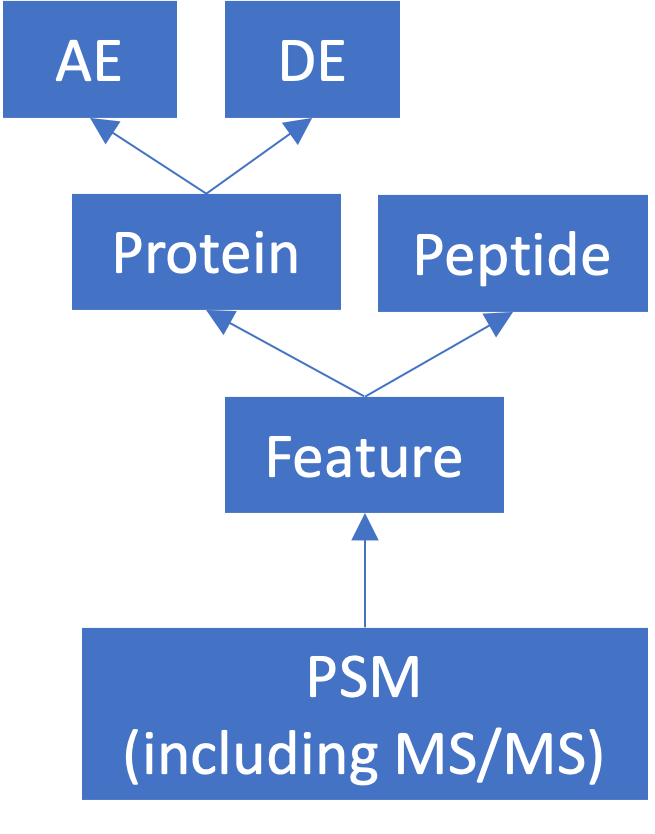

The quantms output
------------------

`quantms <https://github.com/bigbio/quantms>`__ is a nf-core workflow that allows to process and analyze mass spectrometry data. At the end of the workflow it provides multiple output files. Here this repo defines some outputs that are relevant for AI/ML models development. The relations between the file concepts and formats can be seen in this diagram:

Contents
--------

.. toctree::
   :maxdepth: 1

   introduction
   de
   ae
   peptide
   feature
   psm
   tools

|

The following links should be followed to get support and help with the quantms maintainers:

|Get help on Slack|   |Report Issue| |Get help on GitHub Forum|

.. |Get help on Slack| image:: http://img.shields.io/badge/slack-nf--core%20%23quantms-4A154B?labelColor=000000&logo=slack
                   :target: https://nfcore.slack.com/channels/quantms

.. |Report Issue| image:: https://img.shields.io/github/issues/bigbio/quantms
                   :target: https://github.com/bigbio/quantms/issues

.. |Get help on GitHub Forum| image:: https://img.shields.io/badge/Github-Discussions-green
                   :target: https://github.com/bigbio/quantms/discussions
