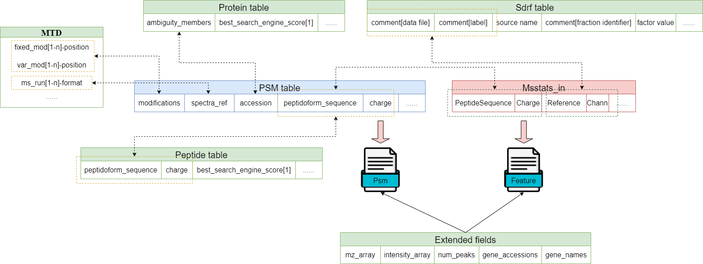

==== quantms.io tools

quantms.io tools provides a standardized set of commands to generate different files for your project. It is mainly used to consolidate the data of each file and generate a standardized file representation. 

   :width: 80%
   :align: center

You can generate separate files or complete project files depending on your needs.A completed project contains the following files:

Project converter tool
-------------------------
If your project comes from the PRIDE database, 
you can use the pride accession to generate a `project.json` that contains 
descriptive information about the entire project.
Or, customize a Project Accession to generate an entirely new project.
You can create a `protein.txt` to generate specific project of the protein information in it.
It's like this:

.. code:: shell

   #protein.txt
   Q07878
   O43660
   P63261

* If you want to know more, please read :doc:`project`.
* If your project is not from PRIDE, you can skip this step.

.. code:: shell

   quantmsioc generate-pride-project-json
      --project_accession PXD014414
      --sdrf PXD014414.sdrf.tsv
      --output_folder result

* Optional parameter

.. code:: shell

   --quantms_version   Quantms version
   --delete_existing   Delete existing files in the output folder(default False)

DE converter tool
--------------------
Differential expression file 
Store the differential express proteins between two contrasts, 
with the corresponding fold changes and p-values.It can be easily visualized using tools such as 
`Volcano Plot <https://en.wikipedia.org/wiki/Volcano_plot_(statistics)>`__ and 
easily integrated with other omics data resources.

* If you have generated project.json, you can use this parameter `--project_file` to add project information for DE files.
* If you want to know more, please read :doc:`de`.

Example: 

.. code:: shell

   quantmsioc convert-de
      --msstats_file PXD014414.sdrf_openms_design_msstats_in_comparisons.csv
      --sdrf_file PXD014414.sdrf.tsv
      --output_folder result

* Optional parameter

.. code:: shell

   --project_file   Descriptive information from project.json(project json path)
   --protein_file   Protein file that meets specific requirements(protein.txt)
   --fdr_threshold   FDR threshold to use to filter the results(default 0.05)
   --output_prefix_file   Prefix of the df expression file(like {prefix}-{uu.id}-{extension})
   --delete_existing   Delete existing files in the output folder(default True)

AE converter tool
--------------------
The absolute expression format aims to visualize absolute expression (AE) results using
iBAQ values and store the AE results of each protein on each sample.

* If you have generated project.json, you can use this parameter `--project_file` to add project information for AE files.
* If you want to know ibaq, please read `ibaqpy <https://github.com/bigbio/ibaqpy>`__
* If you want to know more, please read :doc:`ae`.

Example: 

.. code:: shell

   quantmsioc convert-ae
      --ibaq_file PXD004452-ibaq.csv
      --sdrf_file PXD014414.sdrf.tsv
      --output_folder result

* Optional parameter

.. code:: shell

   --project_file   Descriptive information from project.json(project json path)
   --protein_file   Protein file that meets specific requirements(protein.txt)
   --output_prefix_file    Prefix of the df expression file(like {prefix}-{uu.id}-{extension})
   --delete_existing    Delete existing files in the output folder(default True)

Feature converter tool
-------------------------
The Peptide table aims to cover detail on peptide level including peptide intensity. 
The most of content are from peptide part of mzTab. 
It store peptide intensity to perform down-stream analysis and integration.

* If you want to know more, please read :doc:`feature`.

In some projects, mzTab files can be very large, so we provide both `diskcache` and `no-diskcache` versions of the tool. 
You can choose the desired version according to your server configuration.

Example: 

.. code:: shell

   quantmsioc convert-feature
      --sdrf_file PXD014414.sdrf.tsv
      --msstats_file PXD014414.sdrf_openms_design_msstats_in.csv
      --mztab_file PXD014414.sdrf_openms_design_openms.mzTab
      --output_folder result

* Optional parameter

.. code:: shell

   --use_cache    Whether to use diskcache instead of memory(default True)
   --protein_file   Protein file that meets specific requirements(protein.txt)
   --output_prefix_file   The prefix of the result file(like {prefix}-{uu.id}-{extension})
   --consensusxml_file   The consensusXML file used to retrieve the mz/rt(default None)

Psm converter tool
---------------------
The PSM table aims to cover detail on PSM level for AI/ML training and other use-cases.
It store details on PSM level including spectrum mz/intensity for specific use-cases such as AI/ML training.

* If you want to know more, please read :doc:`psm`.

Example: 
    
.. code:: shell

   quantmsioc convert-psm
      --mztab_file PXD014414.sdrf_openms_design_openms.mzTab
      --output_folder result

* Optional parameter

.. code:: shell

   --use_cache    Whether to use diskcache instead of memory(default True)
   --protein_file   Protein file that meets specific requirements(protein.txt)
   --output_prefix_file   The prefix of the result file(like {prefix}-{uu.id}-{extension})
   --verbose  Output debug information(default True)

DiaNN convert 
--------------------------
For DiaNN, the command supports generating `feature.parquet` and `psm.parquet` directly from diann_report files.

* If you want to see `design_file`, please click `sdrf-pipelines <https://github.com/bigbio/sdrf-pipelines>`__

Example: 

.. code:: shell

   quantmsioc convert-diann
      --report_path diann_report.tsv
      --design_file PXD037682.sdrf_openms_design.tsv
      --qvalue_threshold 0.05
      --mzml_info_folder mzml
      --sdrf_path PXD037682.sdrf.tsv
      --output_folder result
      --output_prefix_file PXD037682
   
* Optional parameter

.. code:: shell

   --duckdb_max_memory   The maximum amount of memory allocated by the DuckDB engine (e.g 4GB)
   --duckdb_threads  The number of threads for the DuckDB engine (e.g 4)
   --file_num The number of files being processed at the same time (default 100)

Maxquant convert 
--------------------------
Convert Maxquant evidence.txt to parquet file

* file

Example: 

.. code:: shell

   quantmsioc convert-maxquant
      --sdrf_file example.sdrf.tsv
      --evidence_file evidence.tsv
      --output_folder result
      --output_prefix_file example

* zip file
.. code:: shell

   quantmsioc convert-zip-maxquant
      --sdrf_file example.sdrf.tsv
      --evidence_file requirement.txt
      --output_folder result
      --output_prefix_file example

requirement.txt like this:

.. code:: shell

   #requirement.txt
   2013_04_03_16_54_Q-Exactive-Orbitrap_1.zip
   2013_04_03_17_47_Q-Exactive-Orbitrap_1.zip

Inject some messages for DiaNN 
-------------------------------
For DiaNN, some field information is not available and needs to be filled with other commands.

* bset-psm-scan-number
Example: 

.. code:: shell

   quantmsioc inject-bset-psm-scan-number
      --diann_psm_path PXD010154-f75fbb29-4419-455f-a011-e4f776bcf73b.psm.parquet
      --diann_feature_path PXD010154_map_protein_accession-88d63fca-3ae6-4eab-9262-6e7a68184432.feature.parquet
      --output_path PXD010154.feature.parquet

* start-and-end-pisition
Example:

.. code:: shell

   quantmsioc inject-start-and-end-from-fasta
      --parquet_path PXD010154_map_protein_accession-88d63fca-3ae6-4eab-9262-6e7a68184432.feature.parquet
      --fasta_path Homo-sapiens-uniprot-reviewed-contaminants-decoy-202210.fasta
      --label feature
      --output_path PXD010154.feature.parquet

Compare psm.parquet
-------------------
This tool is used to compare peptide information in result files obtained by different search engines.

* `--tags` or `-t` are used to specify the tags of the PSM table.

Example: 

.. code:: shell

   quantmsioc compare-set-psms
      -p PXD014414-comet.parquet
      -p PXD014414-sage.parquet
      -p PXD014414-msgf.parquet
      -t comet
      -t sage
      -t msgf

Generate spectra message
-------------------------
generate_spectra_message support psm and feature. It can be used directly for spectral clustering.

* `--label` contains two options: `psm` and `feature`.
* `--partion` contains two options: `charge` and `reference_file_name`.
Since the result file is too large, you can specify `–-partition` to split the result file.

Example: 

.. code:: shell

   quantmsioc map-spectrum-message-to-parquet
      --parquet_path PXD014414-f4fb88f6-0a45-451d-a8a6-b6d58fb83670.psm.parquet
      --mzml_directory mzmls
      --output_path psm/PXD014414.parquet
      --label psm
      --file_num(default 10)
      --partition charge

Generate gene message
-------------------------
generate_gene_message support psm and feature. 

* `--label` contains two options: `psm` and `feature`.
* `--map_parameter` contains two options: `map_protein_name` or `map_protein_accession`.

Example: 

.. code:: shell

   quantmsioc map-gene-msg-to-parquet 
   --parquet_path PXD000672-0beee055-ae78-4d97-b6ac-1f191e91bdd4.featrue.parquet
   --fasta_path Homo-sapiens-uniprot-reviewed-contaminants-decoy-202210.fasta
   --output_path PXD000672-gene.parquet
   --label feature 
   --map_parameter map_protein_name

* Optional parameter

.. code:: shell

   --species species type(default human)

* `species`
  
+-------------+-------------------------+
| Common name |       Genus name        |
+=============+=========================+
|    human    |      Homo sapiens       |
+-------------+-------------------------+
|    mouse    |      Mus musculus       |
+-------------+-------------------------+
|     rat     |    Rattus norvegicus    |
+-------------+-------------------------+
|  fruitfly   | Drosophila melanogaster |
+-------------+-------------------------+
|  nematode   | Caenorhabditis elegans  |
+-------------+-------------------------+
|  zebrafish  |       Danio rerio       |
+-------------+-------------------------+
| thale-cress |  Arabidopsis thaliana   |
+-------------+-------------------------+
|    frog     |   Xenopus tropicalis    |
+-------------+-------------------------+
|     pig     |       Sus scrofa        |
+-------------+-------------------------+

Map proteins accessions
------------------------

get_unanimous_name support parquet and tsv. For parquet, map_parameter
have two option (`map_protein_name` or `map_protein_accession`), and the
label controls whether it is PSM or Feature.

*  parquet
* `--label` contains two options: `psm` and `feature`

Example: 

.. code:: shell

   quantmsioc labels convert-accession
      --parquet_path PXD014414-f4fb88f6-0a45-451d-a8a6-b6d58fb83670.psm.parquet
      --fasta Reference fasta database
      --output_path psm/PXD014414.psm.parquet
      --map_parameter map_protein_name
      --label psm

* tsv
  
Example: 

.. code:: shell

   quantmsioc labels get-unanimous-for-tsv
      --path PXD014414-c2a52d63-ea64-4a64-b241-f819a3157b77.differential.tsv
      --fasta Reference fasta database
      --output_path psm/PXD014414.de.tsv
      --map_parameter map_protein_name

Compare two parquet files
--------------------------
This tool is used to compare the feature.parquet file generated by two versions (`diskcache` or `no-diskcache`).

Example: 

.. code:: shell

   quantmsioc compare-parquet
      --parquet_path_one res_lfq2_discache.parquet
      --parquet_path_two res_lfq2_no_cache.parquet
      --report_path report.txt

Generate report about files 
-----------------------------
This tool is used to generate report about all project.

Example: 

.. code:: shell

   quantmsioc generate-project-report
      --project_folder PXD014414

Register file 
--------------------------
This tool is used to register the file to `project.json`.
If your project comes from the PRIDE database, You can use this command to add file information for `project.json`.

* The parameter `--category` has three options: `feature_file`, `psm_file`, `differential_file`, `absolute_file`.You can add the above file types.
* The parameter `--replace_existing` is enable then we remove the old file and add this one. If not then we can have a list of files for a category.

Example: 

.. code:: shell
   
   quantmsioc attach-file
      --project_file PXD014414/project.json
      --attach_file PXD014414-943a8f02-0527-4528-b1a3-b96de99ebe75.featrue.parquet
      --category feature_file
      --replace_existing

Convert file to json 
--------------------------
This tool is used to convert file to json.

* parquet
* `--data_type` contains two options: `psm` and `feature`
Example: 

.. code:: shell

   quantmsioc convert-parquet-json
      --data_type feature
      --parquet_path PXD014414-943a8f02-0527-4528-b1a3-b96de99ebe75.featrue.parquet
      --json_path PXD014414.featrue.json

* tsv
Example: 

.. code:: shell

   quantmsioc json convert-tsv-to-json
      --file PXD010154-51b34353-227f-4d38-a181-6d42824de9f7.absolute.tsv
      --json_path PXD010154.ae.json

* sdrf
Example: 

.. code:: shell

   quantmsioc json convert-sdrf-to-json
      --file MSV000079033-Blood-Plasma-iTRAQ.sdrf.tsv
      --json_path MSV000079033.sdrf.json

Statistics
-----------
This tool is used for statistics.
Example: 

.. code:: shell

   quantmsioc project-ae-statistics
      --absolute_path PXD010154-51b34353-227f-4d38-a181-6d42824de9f7.absolute.tsv
      --parquet_path PXD010154-51b34353-227f-4d38-a181-6d42824de9f7.featrue.parquet
      --save_path PXD014414.statistic.txt

.. code:: shell

   quantmsioc parquet-psm-statistics
      --parquet_path PXD010154-51b34353-227f-4d38-a181-6d42824de9f7.psm.parquet
      --save_path PXD014414.statistic.txt

Plots
-------
This tool is used for visualization.
* plot-psm-peptides
  
.. code:: shell

   quantmsioc plot plot-psm-peptides
      --psm_parquet_path PXD010154-51b34353-227f-4d38-a181-6d42824de9f7.psm.parquet
      --sdrf_path PXD010154.sdrf.tsv
      --save_path PXD014414_psm_peptides.svg

* plot-ibaq-distribution
  
.. code:: shell

   quantmsioc plot plot-ibaq-distribution
      --ibaq_path PXD010154-51b34353-227f-4d38-a181-6d42824de9f7.ibaq.tsv
      --select_column IbaqLog
      --save_path PXD014414_psm_peptides.svg

* plot-kde-intensity-distribution

.. code:: shell

      quantmsioc plot plot-kde-intensity-distribution
      --feature_path PXD010154-51b34353-227f-4d38-a181-6d42824de9f7.featrue.parquet
      --num_samples 10
      --save_path PXD014414_psm_peptides.svg

* plot-bar-peptide-distribution

.. code:: shell

      quantmsioc plot plot-bar-peptide-distribution
      --feature_path PXD010154-51b34353-227f-4d38-a181-6d42824de9f7.featrue.parquet
      --num_samples 10
      --save_path PXD014414_psm_peptides.svg

* plot-box-intensity-distribution

.. code:: shell

      quantmsioc plot plot-box-intensity-distribution
      --feature_path PXD010154-51b34353-227f-4d38-a181-6d42824de9f7.featrue.parquet
      --num_samples 10
      --save_path PXD014414_psm_peptides.svg